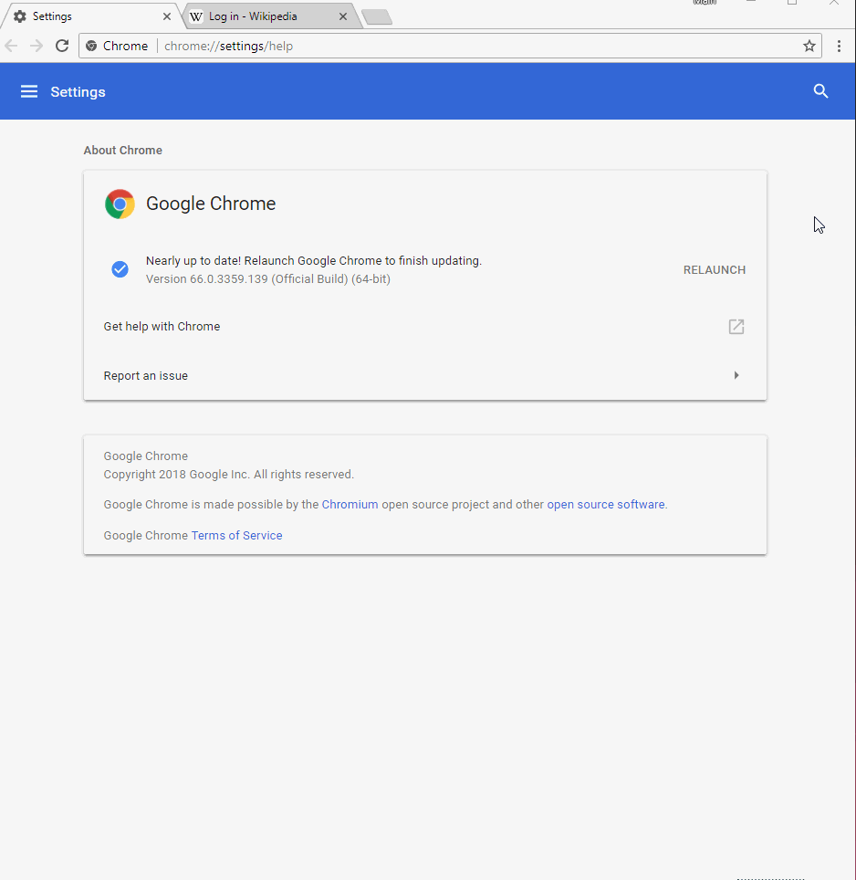

# Password Revealer with Keyboard Shortcut
Convert any password field to human-readable text.  Works on any site with password fields

Just click the extension icon or hit `Alt+R`

## [Get Extension from Chrome Web Store](https://chrome.google.com/webstore/detail/password-revealer-with-ke/knbnoooohffobecbjfgemggdbmbhenpo)

## Changing the Keyboard Shortcut

The default is `Alt+R` but you can change shortcuts for any chrome extension:
1. Go to More Tools > Extensions (`chrome://extensions/`)
2. Scroll to the bottom & choose **Keyboard Shortcuts**
3. Find **"Password Revealer with Keyboard Shortcut"** and type in a new shortcut

